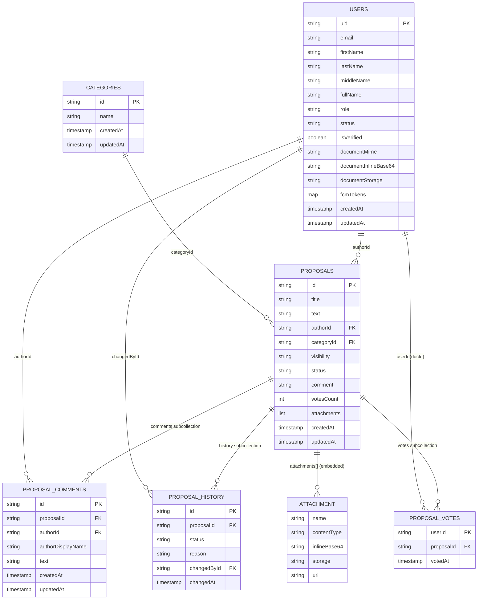

# Логическая модель БД (Firestore)

Проект использует **Firebase Firestore** (документная БД). Ниже — логическая модель сущностей и связей в формате ER-диаграммы.

## Примечания по реализации

- `PROPOSAL_COMMENTS`, `PROPOSAL_HISTORY`, `PROPOSAL_VOTES` — это **субколлекции** внутри документа `proposals/{proposalId}`.
- В `PROPOSAL_VOTES` идентификатор документа равен `userId` (гарантирует один голос пользователя на предложение).
- `votesCount` в `PROPOSALS` — денормализованный счетчик голосов для быстрой сортировки/отображения.
- `attachments` хранятся как встроенный массив объектов внутри `PROPOSALS` (в текущей реализации чаще в base64).
- `categoryId` может быть служебным значением `uncategorized` (без явного документа в `CATEGORIES`).
- В Firestore связи логические (по `id`), без жестких FK-ограничений на уровне БД.
