# UML-диаграмма вариантов использования — kasabov_dgtu

## PlantUML (исходный код)

```plantuml
@startuml kasabov_dgtu_use_cases

skinparam actorStyle awesome
skinparam packageStyle rectangle
skinparam roundcorner 10

left to right direction

actor "Гость"          as Guest
actor "Студент"        as Student
actor "Преподаватель"  as Staff
actor "Модератор"      as Moderator
actor "Администратор"  as Admin

Student  --|> Guest
Staff    --|> Student
Moderator --|> Guest
Admin    --|> Moderator

rectangle "Система предложений ДГТУ" {

  package "Аутентификация" {
    (Регистрация)              as UC_Reg
    (Вход в систему)           as UC_Login
    (Сброс пароля)             as UC_Reset
    (Верификация email)        as UC_EmailVerif
  }

  package "Лента предложений" {
    (Просмотр ленты)           as UC_Feed
    (Поиск предложения)        as UC_Search
    (Фильтр по статусу)        as UC_FilterStatus
    (Фильтр по категории)      as UC_FilterCat
    (Фильтр по дате)           as UC_FilterDate
    (Мои предложения)          as UC_MyProposals
    (Сортировка)               as UC_Sort
  }

  package "Работа с предложениями" {
    (Создать предложение)      as UC_Create
    (Редактировать предложение) as UC_Edit
    (Удалить предложение)      as UC_Delete
    (Просмотреть детали)       as UC_Detail
    (Прикрепить фото)          as UC_Attach
    (Выбрать категорию)        as UC_SelectCat
  }

  package "Голосование" {
    (Проголосовать «за»)       as UC_VoteFor
    (Проголосовать «против»)   as UC_VoteAgainst
    (Снять голос)              as UC_ClearVote
    (Просмотр активных голосований) as UC_ActiveVotes
  }

  package "Комментарии" {
    (Оставить комментарий)     as UC_Comment
    (Просмотреть комментарии)  as UC_ViewComments
  }

  package "Модерация" {
    (Изменить статус предложения) as UC_SetStatus
    (Опубликовать предложение) as UC_Publish
    (Запустить автопроверки)   as UC_AutoCheck
    (Просмотреть историю)      as UC_History
    (Установить срок голосования) as UC_Deadline
    (Передать в подразделение) as UC_Transfer
    (Управление пользователями) as UC_ManageUsers
    (Верифицировать пользователя) as UC_VerifyUser
  }

  package "Администрирование" {
    (Управление категориями)   as UC_ManageCats
    (Создать категорию для преподавателей) as UC_StaffCat
    (Назначить роль)           as UC_AssignRole
    (Удалить предложение)      as UC_AdminDelete
  }

  package "Статистика и отчёты" {
    (Просмотреть статистику)   as UC_Stats
    (Экспорт в PDF)            as UC_ExportPDF
    (Экспорт в XLSX)           as UC_ExportXLSX
  }

  package "Профиль" {
    (Просмотреть профиль)      as UC_Profile
    (Подписаться на категорию) as UC_Subscribe
    (Переключить тему)         as UC_Theme
    (Выйти из аккаунта)        as UC_Logout
  }
}

' Гость
Guest --> UC_Reg
Guest --> UC_Login
Guest --> UC_Reset

' Студент (наследует от Гостя)
Student --> UC_EmailVerif
Student --> UC_Feed
Student --> UC_Search
Student --> UC_FilterStatus
Student --> UC_FilterCat
Student --> UC_FilterDate
Student --> UC_MyProposals
Student --> UC_Sort
Student --> UC_Detail
Student --> UC_Create
Student --> UC_Edit
Student --> UC_Delete
Student --> UC_Attach
Student --> UC_SelectCat
Student --> UC_VoteFor
Student --> UC_VoteAgainst
Student --> UC_ClearVote
Student --> UC_ActiveVotes
Student --> UC_Comment
Student --> UC_ViewComments
Student --> UC_Profile
Student --> UC_Subscribe
Student --> UC_Theme
Student --> UC_Logout

' Преподаватель (+ категории только для преподавателей)
Staff    --> UC_StaffCat : <<extend>>

' Модератор (+ все функции модерации)
Moderator --> UC_SetStatus
Moderator --> UC_Publish
Moderator --> UC_AutoCheck
Moderator --> UC_History
Moderator --> UC_Deadline
Moderator --> UC_Transfer
Moderator --> UC_ManageUsers
Moderator --> UC_VerifyUser
Moderator --> UC_Stats
Moderator --> UC_ExportPDF
Moderator --> UC_ExportXLSX

' Администратор (+ администрирование)
Admin --> UC_ManageCats
Admin --> UC_AssignRole
Admin --> UC_AdminDelete

' Связи include/extend
UC_Create ..> UC_Attach   : <<include>>
UC_Create ..> UC_SelectCat : <<include>>
UC_VoteFor ..> UC_SetStatus : <<extend>>\n(авто, 10+ голосов)
UC_Stats   ..> UC_ExportPDF : <<extend>>
UC_Stats   ..> UC_ExportXLSX : <<extend>>

@enduml
```

---

## Текстовое описание вариантов использования

### Акторы

| Актор | Описание |
|---|---|
| Гость | Неаутентифицированный пользователь |
| Студент | Верифицированный студент |
| Преподаватель | Сотрудник/преподаватель (staff) — расширяет права студента |
| Модератор | Проверяет и публикует предложения |
| Администратор | Полный доступ, управление пользователями и категориями |

### Ключевые сценарии

#### UC-01: Создать предложение
- **Актор:** Студент / Преподаватель
- **Предусловие:** Пользователь верифицирован
- **Основной поток:**
  1. Пользователь нажимает «Новое предложение»
  2. Заполняет тему, текст, категорию
  3. Прикрепляет фото (опционально)
  4. Отправляет на модерацию
- **Результат:** Предложение создано со статусом `submitted`

#### UC-02: Голосование с авто-продвижением
- **Актор:** Студент / Преподаватель
- **Предусловие:** Предложение имеет статус `published`, дедлайн голосования не истёк
- **Основной поток:**
  1. Пользователь голосует «за»
  2. Если голосов «за» ≥ 10 → статус меняется на `in_progress` автоматически
- **Результат:** Голос учтён; возможно автоматическое продвижение статуса

#### UC-03: Публикация предложения (модератор)
- **Актор:** Модератор
- **Основной поток:**
  1. Модератор просматривает предложение
  2. Запускает автопроверки (опционально)
  3. Устанавливает срок голосования (опционально)
  4. Нажимает «Опубликовать»
- **Результат:** Предложение видно в публичной ленте, доступно для голосования

#### UC-04: Выгрузка отчёта
- **Актор:** Модератор / Администратор
- **Основной поток:**
  1. Выбирает период и категорию
  2. Нажимает «PDF» или «XLSX»
  3. Файл формируется с данными: ФИО, email, роль автора, название, категория, статус, голоса
- **Результат:** Файл отчёта доступен для сохранения или передачи

#### UC-05: Категории только для преподавателей
- **Актор:** Администратор (создание), Преподаватель (использование)
- **Основной поток:**
  1. Администратор создаёт категорию с флагом «Только преподаватели»
  2. При создании предложения студенты не видят эту категорию в списке
  3. Преподаватель может выбрать категорию и создать предложение
- **Результат:** Разграничение тематики предложений по ролям
